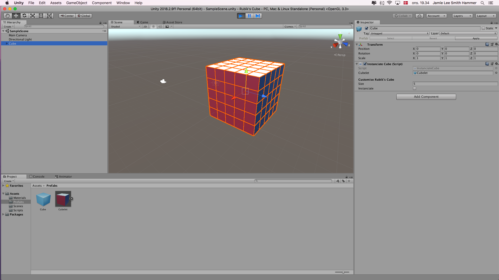

# Rubiks-Cube
Rubiks Cube Generator for Unity, written in C#

## How To Build / Compile
This is a Unity project. If you're familiar with source control, then "clone this repo". Otherwise download the contents, and navigate to Assets > Scenes then open the SampleScene.unity file.

## How To Use the Rubik's Cube Instantiater
When the editor is in play mode, you can specify how big you want the cube and hit the boolean instantiate, to have the script do it's thing.

## What's to come?
I am working on making this a tool and put it on the asset store, until then, you can have this simple version for absolutely free. I also intend to make it playable when I get that part right!
